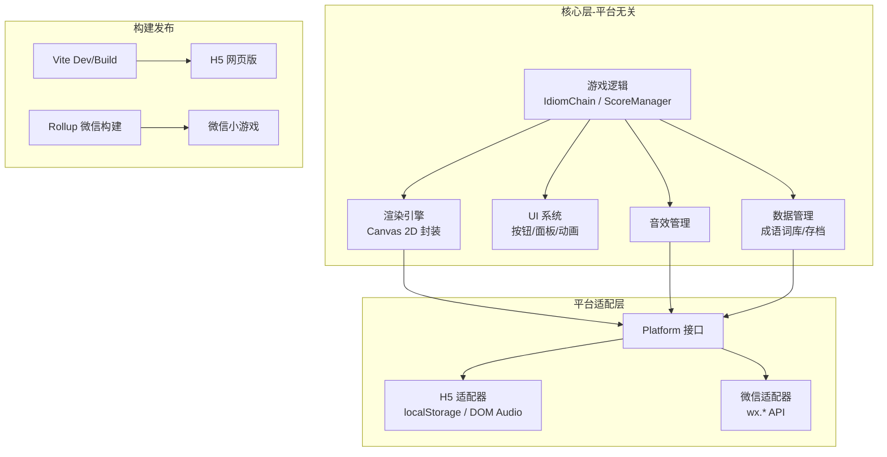

# 成语接龙 H5 小游戏 - 纯代码技术栈选型方案

## 方案对比与推荐

经调研，以下是四个纯代码方案的对比：

- **Phaser 3**: 功能强大但微信小游戏适配已官方停止支持，Blob 依赖问题无法解决，**排除**
- **PixiJS**: 高性能 2D 渲染引擎，但对于文字交互类游戏过重，微信适配需额外工作
- **前端框架（Vue/React）**: 微信小游戏不支持 DOM，无法直接运行，需要 Taro 等转换层，引入额外复杂度
- **原生 Canvas + TypeScript**: 零依赖、包体最小、双平台适配最直接，成语接龙这类游戏的渲染需求完全可以胜任

### 最终推荐：原生 Canvas + TypeScript + Vite

**理由：**

1. 成语接龙以文字交互为主，Canvas 2D API 完全满足渲染需求
2. 微信小游戏本质就是 Canvas 环境，原生 Canvas 代码适配成本最低
3. 零框架依赖，包体极小，微信小游戏主包 4MB 限制无压力
4. TypeScript 保证代码质量，Vite 提供现代化开发体验
5. 通过平台适配层 + 构建配置，实现一套代码双平台发布

---

## 技术栈清单

### 核心技术

- **语言**: TypeScript 5.x
- **渲染**: 原生 Canvas 2D API
- **构建工具**: Vite（H5 开发/构建）+ Rollup 插件（微信小游戏构建）
- **包管理**: pnpm

### 架构设计




---

## 项目结构

```
chengyujielong/
├── src/                             # 源代码（一套代码）
│   ├── core/                        # 核心游戏引擎（平台无关）
│   │   ├── Engine.ts                # 游戏主循环（requestAnimationFrame）
│   │   ├── Scene.ts                 # 场景基类与场景管理
│   │   └── GameObject.ts            # 游戏对象基类
│   ├── game/                        # 游戏业务逻辑
│   │   ├── GameManager.ts           # 游戏流程管理
│   │   ├── IdiomChain.ts            # 成语接龙核心算法
│   │   └── ScoreManager.ts          # 计分系统
│   ├── render/                      # 渲染系统
│   │   ├── CanvasRenderer.ts        # Canvas 2D 渲染封装
│   │   ├── TextRenderer.ts          # 文字渲染（支持中文排版）
│   │   └── AnimationSystem.ts       # 缓动/动画系统
│   ├── ui/                          # UI 组件
│   │   ├── UIComponent.ts           # UI 基类（按钮、面板等）
│   │   ├── Button.ts                # 按钮组件
│   │   ├── Panel.ts                 # 面板组件
│   │   └── scenes/                  # 游戏场景
│   │       ├── MenuScene.ts         # 主菜单
│   │       ├── GameScene.ts         # 游戏主场景
│   │       └── ResultScene.ts       # 结果页
│   ├── data/                        # 数据层
│   │   ├── IdiomDatabase.ts         # 成语数据库（查询/索引）
│   │   ├── idioms.json              # 成语词库数据
│   │   └── StorageManager.ts        # 存档管理
│   ├── audio/                       # 音效管理
│   │   └── AudioManager.ts          # 音效播放（跨平台）
│   ├── platform/                    # 平台适配层
│   │   ├── Platform.ts              # 平台接口定义
│   │   ├── H5Platform.ts            # H5 平台实现
│   │   └── WXPlatform.ts            # 微信小游戏平台实现
│   ├── utils/                       # 工具函数
│   │   └── index.ts
│   ├── main.ts                      # H5 入口
│   └── main.wx.ts                   # 微信小游戏入口
├── public/                          # 静态资源（图片/音效/字体）
│   ├── images/
│   ├── audio/
│   └── fonts/
├── wx/                              # 微信小游戏构建模板
│   ├── game.json                    # 微信小游戏配置
│   ├── project.config.json          # 微信开发者工具配置
│   └── weapp-adapter.js             # 微信小游戏适配器
├── index.html                       # H5 入口 HTML
├── vite.config.ts                   # Vite 配置（H5）
├── vite.config.wx.ts                # Vite 配置（微信小游戏构建）
├── tsconfig.json                    # TypeScript 配置
├── package.json                     # 项目依赖
└── .gitignore
```

---

## 关键技术细节

### 1. 平台适配层设计

```typescript
// src/platform/Platform.ts
export interface IPlatform {
  createCanvas(width: number, height: number): HTMLCanvasElement;
  getScreenSize(): { width: number; height: number };
  getDevicePixelRatio(): number;
  onTouchStart(callback: (e: TouchEvent) => void): void;
  onTouchMove(callback: (e: TouchEvent) => void): void;
  onTouchEnd(callback: (e: TouchEvent) => void): void;
  loadImage(src: string): Promise<HTMLImageElement>;
  playAudio(src: string): void;
  getStorage(key: string): string | null;
  setStorage(key: string, value: string): void;
  shareGame?(title: string, imageUrl: string): void;
}
```

H5 平台直接使用 DOM API；微信平台使用 `wx.*` API 实现相同接口。入口文件根据平台注入不同实现。

### 2. 成语数据结构

```typescript
interface IdiomEntry {
  word: string;       // "一马当先"
  pinyin: string;     // "yī mǎ dāng xiān"
  first: string;      // 首字拼音 "yi"
  last: string;       // 末字拼音 "xian"
  meaning: string;    // 释义
}
```

按末字拼音建立 Map 索引，O(1) 查找可接龙的成语列表。

### 3. 双平台构建

- **H5**: `vite build` 输出到 `dist/h5/`，产物为标准网页
- **微信小游戏**: `vite build --config vite.config.wx.ts` 输出到 `dist/wx/`，合并 `wx/` 模板文件，产物可直接用微信开发者工具打开
- npm scripts: `dev`（H5 开发）、`build:h5`（H5 构建）、`build:wx`（微信构建）

### 4. 游戏主循环

```typescript
// 基于 requestAnimationFrame 的游戏主循环
class Engine {
  private loop(timestamp: number) {
    const deltaTime = timestamp - this.lastTime;
    this.lastTime = timestamp;
    this.currentScene?.update(deltaTime);
    this.currentScene?.render(this.ctx);
    requestAnimationFrame((t) => this.loop(t));
  }
}
```

### 5. 动画系统

自实现轻量级 Tween 缓动系统，支持：

- 位移、缩放、透明度、颜色渐变
- 常用缓动函数（easeIn/easeOut/easeInOut/bounce 等）
- 动画链、并行动画、延迟执行

---

## 开发与调试工作流

- **H5 开发**: `pnpm dev` 启动 Vite 开发服务器，浏览器实时预览 + HMR 热更新
- **微信调试**: `pnpm build:wx` 构建后，用微信开发者工具打开 `dist/wx/` 目录调试
- **代码编写**: 全部在 Cursor IDE 中完成，无需任何可视化编辑器

---

## 依赖清单

生产依赖：**无**（零运行时依赖，全部原生 API）

开发依赖：

- `typescript` - 类型系统
- `vite` - 构建工具 + 开发服务器
- `miniprogram-api-typings` - 微信小游戏 API 类型定义（可选）

